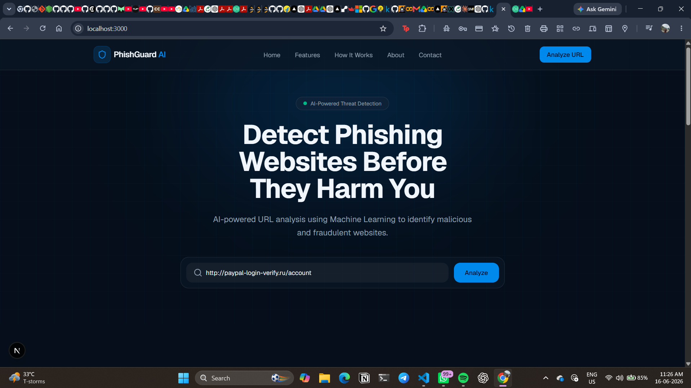

# 🛡️ PhishGuard AI

An AI-powered phishing website detection platform that helps users identify malicious and fraudulent URLs before they cause harm. PhishGuard AI leverages Machine Learning to analyze website URLs and provide risk scores, confidence levels, and phishing predictions through an intuitive web interface.

---

## 📸 Screenshots

### Home Page



*Modern landing page with AI-powered URL analysis interface.*

### Detection Result


*Detailed phishing analysis showing risk score, confidence level, and prediction result.*

---

## 🚀 Features

* 🔍 Real-time URL phishing detection
* 🤖 Machine Learning-based threat analysis
* 📊 Risk score and confidence metrics
* ⚡ Fast and accurate predictions
* 🎨 Modern and responsive user interface
* 🔒 Cybersecurity-focused protection
* 📈 Interactive analysis dashboard

---

## 🧠 How It Works

1. Enter a website URL into the search box.
2. Click **Analyze**.
3. The frontend sends the URL to the Flask backend.
4. URL features are extracted and processed.
5. The trained Machine Learning model predicts whether the website is:

   * ✅ Legitimate
   * ⚠️ Phishing
6. Results are displayed with:

   * Risk Score
   * Threat Score
   * Detection Confidence
   * Prediction Result

---

## 🏗️ Project Architecture

```text
User Input URL
       │
       ▼
 React Frontend
       │
       ▼
 Flask API
       │
       ▼
 Feature Extraction
       │
       ▼
 ML Model Prediction
       │
       ▼
 Analysis Dashboard
```

---

## 🛠️ Tech Stack

### Frontend

* React.js
* JavaScript
* HTML5
* CSS3

### Backend

* Python
* Flask

### Machine Learning

* Scikit-Learn
* Pandas
* NumPy

### Development Tools

* Git
* GitHub
* VS Code

---

## 📊 Sample Detection Output

| Metric     | Value                                     |
| ---------- | ----------------------------------------- |
| Domain     | [www.rrp-mfg.com](http://www.rrp-mfg.com) |
| Risk Score | 73/100                                    |
| Confidence | 73%                                       |
| Prediction | Phishing                                  |

---

## ⚙️ Installation

### Clone Repository

```bash
git clone https://github.com/himanshu0508/PhishGaurd.git
cd PhishGaurd
```

### Backend Setup

```bash
cd backend

python -m venv venv

# Windows
venv\Scripts\activate

# Install dependencies
pip install -r requirements.txt

# Run backend server
python app.py
```

Backend will run on:

```text
http://localhost:5000
```

### Frontend Setup

Open a new terminal:

```bash
cd frontend

npm install

npm start
```

Frontend will run on:

```text
http://localhost:3000
```

---

## 🎯 Usage

1. Start both frontend and backend servers.
2. Open the application in your browser.
3. Enter the URL you want to analyze.
4. Click **Analyze**.
5. Review the phishing detection results.

---

## 🔮 Future Enhancements

* Browser Extension Support
* Deep Learning-based Detection
* Real-Time Threat Intelligence Integration
* Website Screenshot Analysis
* Email Phishing Detection
* URL Reputation Database

---

## 🤝 Contributing

Contributions are welcome.

1. Fork the repository
2. Create your feature branch

```bash
git checkout -b feature-name
```

3. Commit your changes

```bash
git commit -m "Add feature"
```

4. Push to the branch

```bash
git push origin feature-name
```

5. Open a Pull Request

---

## 👨‍💻 Author

**Himanshu Phogat**

GitHub: https://github.com/himanshu0508

---

## ⭐ Support

If you found this project useful, consider giving it a ⭐ on GitHub.

Your support helps improve the project and encourages further development.
